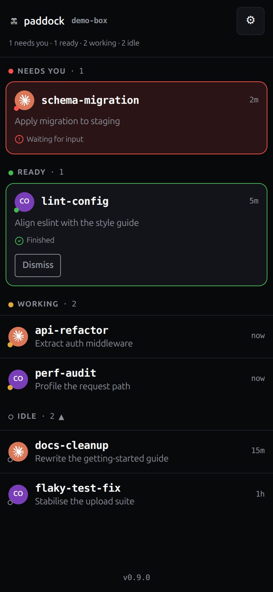
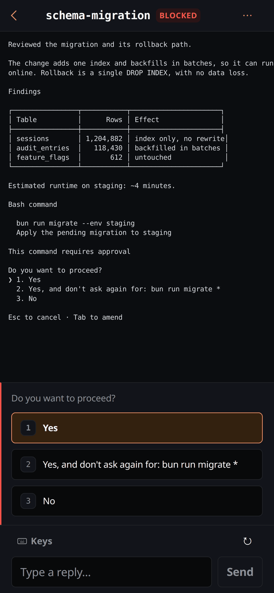
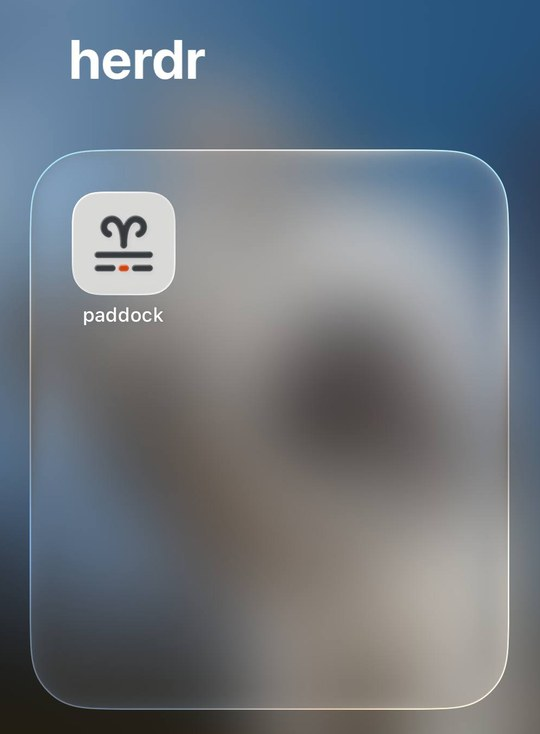

<p align="center">
  
</p>

<h1 align="center">paddock</h1>

<p align="center">
  <a href="https://lntvan166.github.io/paddock/">demo</a> ·
  <a href="#install">install</a> ·
  <a href="docs/running-locally.md">running locally</a> ·
  <a href="#docs">docs</a>
</p>

<p align="center">
  <a href="LICENSE"></a>
  <a href="https://github.com/lntvan166/paddock/releases/latest"></a>
  <a href="https://github.com/lntvan166/paddock/releases"></a>
</p>

---

<p align="center">
  
  
</p>

**watch and answer your coding agents from your phone.**

You have several agents running in [herdr](https://github.com/herdrdev/herdr)
panes. You step away from the desk. One finishes, another hits a permission
prompt, and both sit there waiting — because the only way to find out is to
walk back and look.

- **triage** — grouped into *needs you*, *working*, *idle*, not alphabetically
- **read** — full ANSI colour; prose reflows to the screen, tables keep their columns
- **answer** — the agent's own option labels, and what Enter will commit before you tap it
- **notify** — a Telegram message when an agent needs you, sent only once the
  state has held, with mute and a per-agent cooldown. [settings →](docs/settings.md)
- **reach it in one command** — `paddock tunnel` publishes a temporary URL
  gated by a short-lived pairing code. No DNS, no inbound port, nothing to configure
- **install as an app** — Add to Home Screen gives it an icon and no browser chrome
- **cheap to watch** — adaptive polling, and only changed lines on the wire

[**try the live demo →**](https://lntvan166.github.io/paddock/) — synthetic
agents, no install, best in mobile mode.

---

## install

```bash
curl -fsSL https://lntvan166.github.io/paddock/install.sh | sh
```

Installs to `~/.local/bin/paddock`, no `sudo`, checksum verified before
anything is written · [read it first](https://lntvan166.github.io/paddock/install.sh)
· [binaries](https://github.com/lntvan166/paddock/releases)

Or with Homebrew, which pulls in herdr as a dependency:

```bash
brew install lntvan166/paddock/paddock
```

One command — the fully-qualified name taps and trusts this single formula.
Homebrew 6.0.0 requires explicit trust for a non-official tap, so a bare
`brew install paddock` cannot reach a tap; that name belongs to
`homebrew/core`, which paddock does not qualify for (`docs/decisions.md`).
Homebrew then owns the install, so upgrade with `brew upgrade paddock` —
`paddock update` detects the keg and declines rather than desyncing it.

### herdr version

paddock talks to herdr over herdr's own socket protocol. This release is built
against **protocol 20**, which herdr **0.8.2** speaks. `install.sh` checks after
installing, and you can ask again whenever:

```bash
paddock doctor
```

The check is **directional**. A herdr *newer* than this paddock is accepted and
runs — paddock verifies the fields it actually reads rather than demanding an
exact version number, so a herdr release that adds things breaks nothing. A
herdr *older* than protocol 20 is refused, because paddock would be reading
fields that herdr does not send yet.

So if herdr is older, upgrade herdr **and restart its daemon**: the socket
answers from the running daemon, not from the binary on disk, so upgrading alone
keeps reporting the old protocol.

then start it where herdr is running:

```bash
paddock
```

`ctrl+c` stops it. It serves on `127.0.0.1` only, which is what the next step
is for.

**Do this next — it is the thing paddock is for.** `paddock tunnel` serves the
dashboard *itself*, so `ctrl+c` the one above first, then:

```bash
paddock tunnel
```

That publishes a temporary public URL and a pairing code, and prints both. Nothing to configure, no DNS, no inbound port: open the URL on your
phone, type the code once, and you are watching the same agents from the sofa.
`--for 2h` bounds how long it lives (`30m`, `2h`, `7d`); `ctrl+c` ends it.

It is a try-it path, not a deployment. A quick tunnel cannot have Cloudflare
Access in front of it, so that pairing code is the only gate there is, and the
URL is public until you close it — [from your phone](#from-your-phone) has what
that does and does not protect, and the durable setup.

To keep paddock running after you close the terminal:

```bash
paddock start     # detached
paddock status    # is it up?
paddock stop
```

`paddock tunnel` serves the dashboard itself, so it refuses to start beside a
detached instance — `paddock stop` first, or run the tunnel in its place.

`paddock update` upgrades it; paddock never updates itself unasked. `paddock
--demo` runs it with synthetic agents and no herdr.

It checks for a newer release at most once a day, caching the answer in
`~/.config/paddock/update-check.json` — set `PADDOCK_NO_UPDATE_CHECK=1` and it
makes no request and writes nothing. A running paddock re-reads that answer
hourly, so an instance left up for a week still notices; the once-a-day limit is
on the request, not on the noticing. When there is something newer, the terminal
says so and the dashboard shows a dismissable banner.

> [!WARNING]
> paddock has **no login of its own**. Anyone who reaches its port can send
> keystrokes to your agents, answer their prompts, and read their screens.
> Never port-forward it or bind `0.0.0.0`.

## from your phone

Start here. One command, nothing configured:

```bash
paddock tunnel
```

A temporary Cloudflare quick tunnel, gated by a pairing code — both printed in
the terminal. It dials **out**, so no inbound port is opened and nothing on your
network changes. Pair the phone once and the session lasts as long as the tunnel
does. `--for 2h` bounds how long it lives — `30m`, `2h` and `7d` all parse.

The code is good for **10 minutes**, then it rotates; five wrong guesses burn it
early. It is not single-use, so anything that can read it inside that window can
pair too — treat it like a password for the length of that window, not like a
receipt you have already spent.

Know exactly what that is, though: a try-it path, not a deployment. A quick
tunnel **cannot** have Cloudflare Access in front of it, so the pairing code is
the only gate there is, and the URL is public until you close it. Close it when
you are done rather than leaving it up.

For anything lasting, paddock stays on `127.0.0.1` and you put an
*authenticating* tunnel in front: a [Cloudflare Tunnel with Zero Trust
Access](docs/deploy-cloudflare.md) also dials out, and the identity check
happens before any request reaches paddock at all.

Then **Share → Add to Home Screen**, and it is an app: its own icon, no browser
chrome, and it opens where you left off.

<p align="center">
  
</p>

[running locally →](docs/running-locally.md)

## docs

[running locally](docs/running-locally.md) ·
[settings](docs/settings.md) ·
[cloudflare tunnel](docs/deploy-cloudflare.md) ·
[architecture](docs/architecture.md) ·
[gotchas](docs/gotchas.md) ·
[decisions](docs/decisions.md) ·
[roadmap](docs/roadmap.md)

[`gotchas.md`](docs/gotchas.md) is the one worth reading first if you are
building anything against herdr — it records what its API actually does,
measured rather than assumed.

## development

```bash
bun install
make dev     # vite HMR + server reload
make test    # builds the UI first, then runs the suite
```

`make check` is `tsc --noEmit`; `make check-clean` scans for anything that
should not be in a public repo. [contributing →](CONTRIBUTING.md)

## contributing

Issues and pull requests welcome — especially **multi-host** (several machines
in one list, the biggest gap left), a **linter**, and **more component tests**.
[roadmap →](docs/roadmap.md) · [house rules →](CONTRIBUTING.md)

## thanks

The idea comes from [herdr-remote](https://github.com/dcolinmorgan/herdr-remote)
by dcolinmorgan: pushing herdr agent status to a phone for monitoring and
one-tap approval.

paddock reuses that **concept** and none of its implementation. herdr-remote is
AGPL-3.0-or-later; paddock is MIT. No code, markup or styling has been copied
between them, and the two solve the problem differently — herdr-remote relays
through a Python service, paddock speaks herdr's socket protocol directly.

## license

MIT — see [LICENSE](LICENSE).
