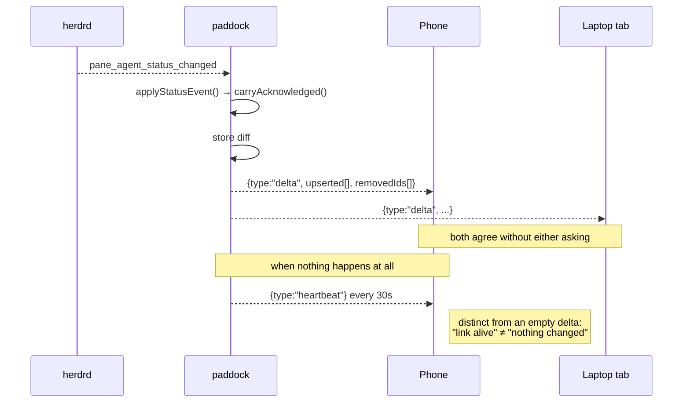
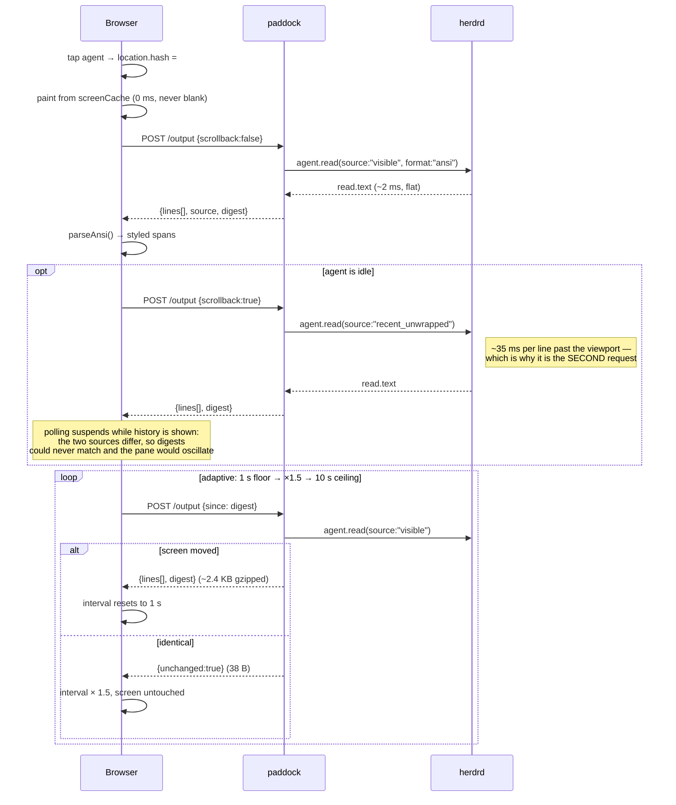
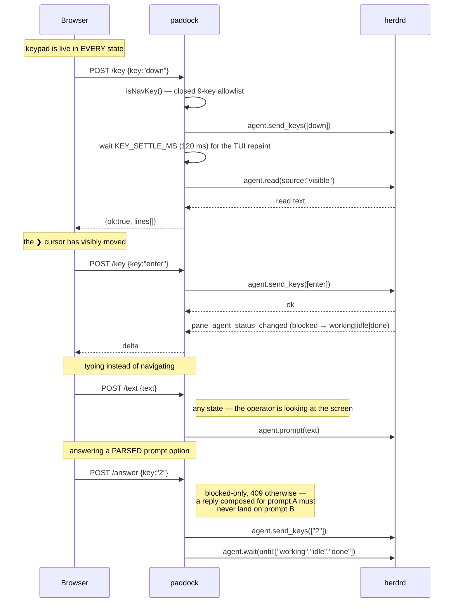

# Architecture

One process. No relay hop, no plugin, no polling loop.

```
              unix socket: $HOME/.config/herdr/herdr.sock
                          │
   ┌──────────────────────┴───────────────────────┐
   │                                              │
 ONE long-lived STREAM connection      ONE SHORT-LIVED connection
 events.subscribe → stays open,        PER REQUEST — herdr closes it
 pushes status/lifecycle events        after a single response
   │                                     ping (protocol check, at startup)
   │                                     agent.list (initial + 30s reconcile)
   │                                     workspace.list (labels)
   │                                              │
 ┌─┴──────────────── paddock (Bun, 127.0.0.1:8787) ┴──────────────┐
 │  herdr/socket.ts   state/store.ts    ws/hub.ts    static UI    │
 │  stream + request   Map<agentId>      snapshot +   Vite bundle │
 │  protocol check     authoritative     deltas +     (no sw.js)  │
 │  bounded waits                        heartbeat                │
 └───────────────────────────┬────────────────────────────────────┘
                             │ HTTPS + WSS
              Cloudflare Tunnel ── Access ── browser / phone
```

## Modules

| Module | Responsibility |
|---|---|
| `server/herdr/socket.ts` | Unix socket client. One-shot `request()`, long-lived `openStream()`, protocol check. Every wait is bounded (10s) — a herdr that accepts a connection and never answers must fail, not hang. Reports stream up/down via a callback, including a reopen that tore down a live socket and failed to replace it. The **only** thing that speaks the herdr wire format. |
| `server/herdr/keeper.ts` | Reconnect-with-backoff on top of that callback. Retries `Supervisor.refresh()` with jittered backoff until the stream is back; a protocol mismatch is fatal rather than retried. Idempotent, so a flapping socket cannot spawn a loop per drop. |
| `server/herdr/adapter.ts` | Normalizes herdr payloads into `shared/types.ts`. The only place field mapping lives. `toAgent` maps one row; `toAgents` decides the LABEL across the whole list, because the fallback for an unnamed agent (`basename(cwd)`, then `project p1`, then `project w1:p1`) depends on what the other rows are called. It is the only code permitted to read `cwd` for a label, and it earns that by guaranteeing two rows can never render identically — see decision 15. |
| `server/supervisor.ts` | The herdr-facing control loop. Reconciles (`workspace.list` + `agent.list`) into the store, keeps the per-pane subscription set pointed at the live panes, applies status events without a round trip, and serializes overlapping refreshes into one. Exposes `lastEventAt` for `/api/health`. |
| `server/state/store.ts` | Authoritative in-memory `Map<string, Agent>` keyed by `agentId` alone (the herdr `pane_id`). `hostId` is carried on every `Agent` record but is not part of the key — see `docs/roadmap.md` for what multi-host requires. Computes deltas. Knows nothing about transport. |
| `server/demo.ts` | Synthetic agents for `--demo`, with invented names. Ticks go through the store like everything else, so the store is authoritative in both modes. Knows nothing about herdr, and takes the store structurally so it imports nothing downstream. |
| `server/ws/hub.ts` | Browser fan-out. Full snapshot on connect, coalesced deltas after, and a 20s heartbeat so a quiet-but-live link does not read as stale. Knows nothing about herdr. |
| `server/herdr/actions.ts` | The herdr calls behind reading a pane and answering a blocked agent, and the home of the bounds on both numeric parameters (`resolveReadLines`, `resolveWaitTimeoutMs` — clamped out of range, defaulted when malformed): `readOutput`/`readDetection` (both typed with the generated `HerdrPaneRead` envelope, since the text is at `result.read.text`; source picked by `readSourceFor`, which gives scrollback to an `idle` agent and the viewport to every other state — see gotchas), `sendOptionKey`/`sendReply`, and `waitUntilUnblocked` (waits on *leaving* `blocked`, not on reaching `working`). Bound to one socket path via `createActions` so `routes.ts` takes it as an injectable `HerdrActions`, omitted entirely in `--demo`. |
| `server/herdr/prompt-parse.ts` | Turns a `detection` snapshot into `ParsedPrompt` — the last contiguous run of numbered option lines, plus the question line pinned to that run. Returns `options: null` rather than guess when the shape does not hold. The only place that knows the numbered-menu text format. |
| `server/routes.ts` | Hono routes, plus the static-file / SPA fallback handler. Read-only routes (`/api/health`, `/api/agents`) and `/ack` are always registered — `/ack` touches only the store and the hub, so gating it on herdr would break it in `--demo`. The three herdr-backed action routes (`/output`, `/prompt`, `/answer`) are added only `if (deps.actions)`, so they do not exist there. Client-supplied values are validated at this boundary before they reach a herdr parameter: `:id` against the store, `lines` through `resolveReadLines`, and `key` against the option-digit pattern. |
| `server/settings/store.ts` | Loads and atomically persists `~/.config/paddock/settings.json` (mode `0600`, override with `PADDOCK_CONFIG_DIR`): the Telegram token/chat id, notification triggers and their settle windows, the mute instant, and the public URL used in a notification's deep link. `migrate()` normalises every stored shape to the current one — explicitly, field by field, because a shallow merge once let a missing settle window mean "fire immediately". `view()` is the only thing routes and the notifier read from it, and it never includes the token itself — only whether one is `configured` and its last four characters. |
| `server/update-check.ts` | The once-a-day "is there a newer release" check, and nothing else. `scheduleUpdateChecks` keeps asking for as long as paddock runs (hourly), because a single boot-time call froze `latestKnown` for the life of the process — the long-lived case is the whole point of `paddock start`. The timer is NOT the rate limit; the 24h cache below is, so the network behaviour is unchanged. It takes a FACTORY, not a `CheckOpts`: a captured `now` would make every tick look like the same instant and the cache would never appear to expire. Caches the last check time and last seen tag in `~/.config/paddock/update-check.json` (mode `0600`, same directory and same posture as `settings.json`; `PADDOCK_CONFIG_DIR` moves both). **Off entirely with `PADDOCK_NO_UPDATE_CHECK=1`**, and off automatically for a `0.0.0-dev` build. Every failure — unreachable API, unwritable cache — is logged at INFO and returns `null`; `startUpdateCheck` owns the `.catch` so a failed check can never take the server down. |
| `server/notify/notifier.ts` | Watches deltas for a state **transition**, then arms a per-trigger timer and sends a Telegram message only once that state has **held** for the settle window — the next transition cancels it. Subject to mute and a per-agent cooldown, which defers rather than drops. Owns timers, so it also owns `dispose()`, called from the shutdown path. A leaf off the composition root. `fanOut()` is the small function `index.ts` composes with `hub.queue` so a delta reaches both without either learning the other exists. |
| `server/notify/telegram.ts` | One HTTPS POST to the Telegram Bot API, with a bounded timeout. Transport only — every policy decision (whether to send, to whom, how often) lives in `notifier.ts`, not here. |
| `server/lifecycle/state.ts` | Owns `$PADDOCK_CONFIG_DIR/paddock.state.json` (`{ pid, args, port, version, startedAt }`, mode `0600`, written atomically: tmp file, `fsync`, `rename`) and the identity check on top of it — `checkState` reads it back into `none \| stale \| mismatch \| running \| unreadable`. `capturedArgs` is the one producer of the `args` string, at both write time and compare time, so `stop` and startup are always comparing like with like; it is **not** rebuilt from `Bun.argv`, which was measured on a compiled binary invoked as `./bin/probe start --demo` to report `["bun", "/$bunfs/root/probe", "start", "--demo"]` (with `process.execPath` giving only the resolved absolute path) against `ps -p <pid> -o args=`'s `./bin/probe start --demo` — the invocation as typed, relative path and all — which no combination of the other two can reconstruct. It tries `/proc/<pid>/cmdline` first, measured byte-identical to `ps` on Linux, and falls back to `ps` for macOS, where `/proc` does not exist; `/proc` is also what makes this work inside `oven/bun:1-alpine`, whose busybox `ps` supports neither `-p` nor a selectable `args` column. |
| `server/lifecycle/commands.ts` | The three verbs — `runStatus`, `runStop`, `runStart` — built on `state.ts` alone. All three refuse rather than guess on `unreadable` state, and refuse to signal (`stop`) or clear-and-retry safely (`start`) on `mismatch`, the recycled-pid case. `runStop` sends `SIGTERM`, polls up to 10s, and only escalates to `SIGKILL` under `--force`, re-checking identity immediately before that unblockable signal. `runStart` spawns a detached child (stdio redirected to `paddock.log`, truncated every start) and reports success only once the state file reappears **and** `GET /api/health` answers. |
| `server/term.ts` | How operator-facing output is written: `paint` emphasises backticked spans, `say`/`warn` are the two sinks, `useColour` decides whether escapes are emitted at all (per **stream**, so a piped stdout stays clean while stderr keeps its colour). Backticks are the delimiter and colour only decorates — stripping every escape returns the plain line, so `NO_COLOR`, a pipe and a CI log all carry the same information. A leaf: it imports nothing, so any layer may use it without inverting the direction above. |
| `server/boot-log.ts` | Collects the herdr boot diagnostics — stream state, pane count, shape verdict — and renders them as ONE line above the banner, so the URL is not the fourth thing printed. Nothing is dropped: after `end()` every call site logs individually exactly as before, which is what CLAUDE.md's no-swallowing rule depends on. A `broken` shape is deliberately never folded in; it prints in full on its own path. |
| `server/index.ts` | Composition root. The only place that wires stream → supervisor → store → hub, the keeper to the stream's state changes, and (new in v2) the settings store and notifier into that same delta path via `fanOut`. |
| `shared/types.ts` | The one payload contract, imported by server and UI — including `compareAgents`, the single triage comparator both sides sort with, and `carryAcknowledged`, the single rule for carrying `acknowledgedAt` across a state change. |
| `shared/herdr-api.d.ts` | **Generated** from `herdr api schema --json`. Committed. Never hand-edited. Its interface bodies are hand-written in the generator, so `tests/herdr-schema-drift.test.ts` is what actually holds them to the live schema. |
| `web/api.ts` | The client's only fetch layer. POSTs to the action routes; reads (`fetchOutput`/`fetchPrompt`) reject on a non-2xx response instead of resolving with a body whose declared shape doesn't hold, actions (`answerWithKey`/`answerWithText`/`acknowledge`) fold both transport errors and non-2xx bodies into one `ActionResult` so a refusal renders instead of throwing. |
| `web/components/AgentDetail.tsx` | The detail sheet: one agent's output, and — while `blocked` — its parsed prompt options plus a free-text reply box, fetched on open, on a state change, and on the explicit Refresh control. Split into a stateful `AgentDetail` and a hook-free `AgentDetailView`, so the markup is testable with `renderToStaticMarkup` and no DOM. Mounted with `key={openAgent.agentId}` in `App.tsx` so switching the selected agent unmounts the old instance rather than reusing its in-flight state. Attribution across *time* — one agent's successive prompts — is handled instead by tagging the typed reply and the action result with the prompt they belong to: keying on `state` would unmount the sheet on the very delta a successful answer causes. The result line sits outside the `blocked`-only section for that same reason. |
| `web/release-notice.ts` | Whether the new-release banner is still owed, and the only owner of its dismissal key. `shouldShowRelease` is pure and separate from the storage access, because the behaviour worth asserting is that a NEWER release re-shows after an older one was dismissed. Dismissal stores the version, never a boolean — see decision 16. Fails open on a `localStorage` throw, same posture as `install.ts`: this is read during render. |
| `web/components/ReleaseBanner.tsx` | "The binary on the host is behind." Distinct from `UpdateBar`, which means "this TAB is running stale JavaScript" and has a button that fixes it — this one names the command instead, because nothing tappable here could update the host. `--accent`, not `--warn`: a new release must not read as urgently as a stale connection. |
| `web/` | React + Tailwind, single screen. |

## The dependency rule

Dependency direction is strict:

```
herdr/socket → herdr/adapter → state/store → ws/hub → web/
```

Nothing upstream imports anything downstream. `store.ts` must not know about
transport; `hub.ts` must not know about herdr. `src/server/herdr/` is the only
code that knows herdr exists — all field mapping lives in `adapter.ts`, so a
protocol change touches `socket.ts`, `adapter.ts`, and the generated types,
nothing else.

`supervisor.ts` sits between `herdr/` and `state/store.ts`: it imports both,
and nothing downstream of the store. `demo.ts` stands where herdr would, so it
takes the store structurally rather than importing it. `index.ts` is the one
exception by design — a composition root imports everything precisely so no
other module has to.

`notify/` (`notifier.ts` plus its `telegram.ts` transport) hangs off `index.ts`
as a second leaf, alongside `hub.ts`, not chained into the line above: nothing
in `herdr/`, `state/store.ts` or `ws/hub.ts` imports it or knows it exists.
`index.ts` composes the two leaves with `fanOut(hub, notifier)` and passes the
result as `Supervisor`'s single `onDelta`, so one delta reaches both without
either learning the other is there. It deliberately does not live inside
either existing leaf:

- **Not in `hub.ts`.** `hub.ts`'s whole job is fanning a delta out to
  connected browsers over the WebSocket. Calling Telegram from inside it would
  make the browser-transport module aware that a third-party outbound
  integration exists, and a change to notification policy would then risk
  touching the code every browser update depends on.
- **Not in `state/store.ts`.** The store computes deltas and knows nothing
  about what consumes them — that is what lets `demo.ts` stand in for herdr
  without either importing the other. Sending a Telegram message is an
  outbound side effect keyed on *why* a state changed, which is policy the
  store has no business holding.

Composing them at `index.ts` instead keeps that a wiring decision, not a
dependency one: either leaf can change independently, and neither has to
import the other to be told it exists.

`lifecycle/` (`state.ts` plus `commands.ts`) is not in the request path at
all, and it is not a third leaf beside `notify/` either — it runs *around*
the server rather than off a delta it produces. `index.ts` calls
`writeState`/`removeState` after the port is bound and on `SIGINT`/`SIGTERM`,
and dispatches `status`/`stop`/`start` to `runStatus`/`runStop`/`runStart`
before any of `herdr/`, `state/store.ts` or `ws/hub.ts` is even constructed —
`status` and `stop` need only the state file and a signal-0 probe, and
`start`'s own process never opens a herdr socket or binds a port at all, only
the detached child it spawns does. Nothing in `herdr/`, `state/store.ts` or
`ws/hub.ts` imports `lifecycle/` or knows it exists.

## Actions transport

Reading a pane and answering a blocked agent do not ride the WebSocket at all.
Each is a plain POST route (`/api/agents/:id/output`, `/prompt`, `/answer`,
`/ack`) that calls into `HerdrActions` and returns its result — success or
`ActionResult`-shaped failure — directly in the HTTP response to the caller
that made the request. No correlation id, no round trip through the hub.

The one exception is `/ack`: it sends nothing to herdr at all. It changes
agent state (`acknowledgedAt`) in paddock's own store, so
after updating the store it also queues the resulting delta on the hub —
the same path every other state change already takes — so every other open
browser learns about the dismissal too, not just the tab that tapped it.
`/answer` does not queue anything itself: the option key or reply goes to
herdr, and the resulting state change (leaving `blocked`) arrives back to
every browser, including the one that sent it, through the normal event →
store → delta path once herdr reports it.

## Liveness

Two independent things can be "up", and the operator can tell them apart.

- **herdr → paddock.** The event stream reports up/down; a down arms
  `herdr/keeper.ts`, which retries with jittered backoff. `/api/health`
  reports the stream's own `connected`, never a cached flag, plus
  `lastEventAt` so a stream that is open but delivering nothing is visible.
- **paddock → browser.** The client treats any received message as proof of
  life and calls the data stale after 60s of silence. A quiet system sends
  nothing at all — no agent changed, so no delta — so the hub sends a
  `heartbeat` every 20s. Without it, an overnight session of idle agents
  (the primary use case) would show the staleness banner on a healthy link.

## Sequence: how a request actually flows

Four paths cover everything paddock does. `herdrd` is the herdr daemon behind
the unix socket at `$HOME/.config/herdr/herdr.sock`.

### 1. Startup and first load

One port serves the UI, the API and the WebSocket. `Bun.serve` upgrades
`/ws` and hands every other path to Hono — see "One port, one origin" below.

```mermaid
sequenceDiagram
    participant B as Browser
    participant P as paddock (:8787)
    participant H as herdrd (unix socket)

    Note over P,H: process start
    P->>H: agent.list
    H-->>P: agents[]
    P->>P: adapter → store.replaceAll()
    P->>H: events.subscribe(pane.agent_status_changed, per pane_id)
    Note right of H: subscription needs a pane_id,<br/>so the pane set is reconciled FIRST

    B->>P: GET /  (Cache-Control: no-cache)
    P-->>B: index.html + hashed assets (immutable)
    B->>P: WS upgrade /ws
    P-->>B: {type:"snapshot", hostId, agents[]}
    Note over B: list renders; no further request needed
```

### 2. An agent changes state — the push path

The only thing paddock streams. Costs 0.34 MB/hour idle.



### 3. Opening a terminal, then keeping it live

Output is **never** pushed — herdr has no subscribable output-changed event
(27 subscribable types; `pane.output_matched` needs a match pattern), so the
screen is always pulled.



### 4. Answering a blocked agent



## One port, one origin

`Bun.serve` binds a single port and routes by path: `/ws` upgrades to the
WebSocket, everything else goes to the Hono app, which serves `/api/*` and
then falls through to the built UI in `dist/`.

This is a deliberate choice, not an accident of convenience:

- **Same origin means no CORS**, no preflight on every POST, and no second
  place for a misconfiguration to hide.
- **The client derives its WebSocket URL from `location`, unconditionally**
  (see `docs/gotchas.md`). Splitting the API onto another origin would force
  the client to learn that origin from somewhere — config, build-time
  constant, or a hostname test — and a hostname test is exactly how a working
  dashboard silently becomes a demo screen.
- **One hostname means one Cloudflare Access policy.** Two origins means two,
  and the failure mode of the second one being wrong is a dashboard that
  loads but cannot talk to anything.

Splitting them is possible — the UI is static files and the API is a Hono app
— but it buys nothing here and costs all three of the above.

## Embedded UI, and where `staticDir` fits

The compiled binary is the whole product: `routes.ts`'s `serve()` checks the
**embedded manifest first, `staticDir` second** — `EMBEDDED[path]` (from
`server/embedded.ts`) wins if present, and only a miss falls through to a
`Bun.file` read under `deps.staticDir` (`PADDOCK_STATIC_DIR`, default `dist`).

`server/embedded.ts` is generated per build, not committed
(`scripts/gen-embedded.ts`, run by `make embed`): Vite content-hashes every
asset's filename, so a checked-in manifest would silently drift from the
bundle it claims to describe the moment the hashes changed. Generating it
fresh — and writing an empty map when `dist/` does not yet exist — is what
lets a clean checkout's `make check` typecheck before anything has been built.

**Docker serves from the embedded manifest, not from `staticDir`.** The image's
build stage runs `bun run build:web` *and* `bun run scripts/gen-embedded.ts`,
and the runtime stage copies the resulting `src/` — so `EMBEDDED` is populated
in the container and `serve()`, which checks it first, never reaches the
`staticDir` branch. That generation step is not optional bookkeeping: it is
what makes the image bootable at all, because `routes.ts` imports
`@server/embedded` unconditionally and a `src/` without it dies at startup with
`Cannot find module '@server/embedded'`. `.dockerignore` excludes
`src/server/embedded.ts` for the same reason — `COPY . .` does not honour
`.gitignore`, so without it the image would silently inherit whatever manifest
happened to be lying in the developer's working tree, and an image that boots
on the machine that built it would fail from a clean clone.

`PADDOCK_STATIC_DIR` exists for **`make dev`**. There the UI is served by Vite
and rebuilt constantly, `scripts/dev.sh` generates an *empty* manifest (no
`dist/` yet on a fresh clone), and the interpreted server reads `dist/` off
disk when there is one — so a rebuild is visible on the next request with no
server restart and nothing to recompile. It is also the escape hatch for
pointing a binary at a UI it was not built with, which is a debugging tool
rather than a shipping path.

## Environment

Everything paddock reads from the environment, and nothing it reads that is not
here. `.env.example` is the copy an operator edits.

| Variable | Default | What it does |
| --- | --- | --- |
| `PADDOCK_PORT` | `8787` | The port. Always bound to `127.0.0.1` — see "One port, one origin". |
| `PADDOCK_TUNNEL_PORT` | `8788` | `paddock tunnel` only: the SECOND loopback port, the one wrapped in the pairing gate and the only one `cloudflared` is pointed at. `PADDOCK_PORT` stays completely ungated. |
| `PADDOCK_HOST_ID` | `local` | The label for this machine in the header. |
| `PADDOCK_HERDR_SOCKET` | `$HOME/.config/herdr/herdr.sock` | Where herdr's socket is. |
| `PADDOCK_CONFIG_DIR` | `$HOME/.config/paddock` | Where `settings.json` and `update-check.json` live. |
| `PADDOCK_STATIC_DIR` | `dist` | Fallback UI directory — see the section above. |
| `PADDOCK_TELEGRAM_TOKEN`, `PADDOCK_TELEGRAM_CHAT_ID` | unset | Seed `settings.json` on **first run only**. |
| `PADDOCK_NO_UPDATE_CHECK` | unset | `1` disables the update check completely. |
| `PADDOCK_VERSION` | `0.0.0-dev` | Build-time only, injected by `bun build --define`. Not read at runtime. |

### `PADDOCK_NO_UPDATE_CHECK`, and the file beside `settings.json`

This is the operator's control over whether a dashboard bound to loopback ever
talks to github.com, so it is documented rather than merely implemented. The
check already goes out of its way to be quiet — at most one request per 24
hours, never on a `0.0.0-dev` build, never blocking startup, and silent in the
UI when it fails — but "rarely" is not "never", and for a project this careful
about not leaking usage timing the off switch has to be discoverable.

`PADDOCK_NO_UPDATE_CHECK=1` means no request is made at all, and nothing is
written. The result is that `latestKnown` stays `null` on the health body and
on every WebSocket envelope, so the dashboard simply never mentions an update.

When the check is on, it caches to `~/.config/paddock/update-check.json`:

```json
{ "at": 1755400000000, "latest": "0.2.0" }
```

Mode `0600`, in the same directory as `settings.json` and for the same reason —
it records when this machine last contacted GitHub. Deleting it costs one HTTP
request. The cache is what makes a restart cheap: without it, every start would
be a fresh call.

## Serving several machines

Today `hostId` comes from `PADDOCK_HOST_ID` (default `"local"`) and one
paddock talks to one local herdr socket. A colleague's machine on the same LAN
cannot currently appear in the same dashboard.

The seams exist: `hostId` is on every `Agent` record, rides the delta path,
and is carried in the snapshot. **The blocker is one line of the store** —
`server/state/store.ts` keys its `Map` by `agentId` alone (the herdr
`pane_id`), so two machines can hand out colliding `pane_id`s (`w1:p1` is not
unique across hosts) and silently overwrite each other. Multi-host requires
re-keying by `${hostId}:${agentId}` first. See `docs/roadmap.md`.

The intended shape, once that is done: each machine runs a paddock *agent*
process that pushes its local herdr state to one tunnel-owning *hub*, and
visibility is scoped by Cloudflare Access identity. The reserved
`paddock agent` / `paddock hub` verbs exit with a pointer to the roadmap
rather than doing something half-working.

## Push or pull? The rule for adding anything new

paddock is already both. The seam is not a compromise — it follows from what
herdr can and cannot tell us, and any future capability should be placed by
the same test rather than by preference.

**Push it when all four hold:**

1. **herdr has an event for it.** Without one, "push" just means the server
   polls instead of the browser, which is the same work in a different place —
   measured at about 1% of the bytes. This is the test that actually decides
   most cases.
2. **It is small.** A delta is broadcast to every connected client; a payload
   that only one of them is looking at does not belong there.
3. **Every client needs it.** Shared state — which agents exist, what they are
   doing — must not disagree between a phone and a laptop tab.
4. **It changes less often than clients look at it.** Otherwise push
   degenerates into streaming, which spec §11 names as the one reliable way to
   make paddock slow.

**Pull it when any one holds:** no herdr event; large payload; only the client
currently looking needs it; or it changes continuously while being watched.

### Where that lands today

| Data | Route | Why |
|---|---|---|
| Agent status (`blocked`/`working`/…) | **push** — `pane.agent_status_changed`, per pane | event-backed, tiny, shared, infrequent |
| Agent appears | **push** — `pane.agent_detected` | event-backed, tiny, shared |
| Agent/pane goes away | **push** — `pane.closed`, `pane.exited` | event-backed, tiny, shared |
| Liveness | **push** — `heartbeat` every 30s | nothing else proves a quiet link is alive |
| `acknowledgedAt` | **push** — paddock's own state, rides the delta | shared: dismissing on a phone must clear the laptop |
| Terminal output | **pull** — `POST /output` | **no herdr event exists**; large; only the viewer needs it; changes constantly |
| Parsed prompt | **pull** — `POST /prompt` | derived from output, same reasoning |
| Everything else | 30s reconcile | a healing net, not a discovery path |

### Known gaps, by the same rule

Both are event-backed, small and shared, so both *should* be pushed and are
currently caught only by the 30s reconcile:

- **`workspace.renamed`** — `Agent.workspaceLabel` is part of the payload, so
  a rename can sit stale on screen for up to 30 seconds.
- **`pane.moved`** — a pane moved between workspaces gets a NEW `pane_id`
  (`docs/gotchas.md`), and `agentId` IS the `pane_id`. Today that reads as a
  remove plus an add, so the detail view of a moved agent closes itself. This
  one matters more than it looks, because it is the same identity question
  multi-host has to answer.

### The one content signal herdr does offer

`pane.output_matched` is **edge-triggered and one-shot** — it fires on the
transition to matching and then goes quiet (measured: a substring printed
three times produced exactly one event; a match-anything regex produced none
at all). That makes it useless for keeping a screen in sync, which is why
output is pulled.

But the same property makes it exactly right for **alerts**, and that is where
it should be used when it is: stuck-agent detection (`docs/roadmap.md`), or
Web Push when a specific pattern appears. Do not reach for it as a sync
mechanism; it is a doorbell, not a feed.

### Adding a new pushed event

1. Add the subscribe name to `server/herdr/socket.ts` — dotted for the three
   `SubscriptionEventKind` types, and remember delivered names are
   **underscored** for everything else (`pane.closed` arrives as `pane_closed`).
2. Map it in `server/herdr/adapter.ts`. herdr vocabulary stops there.
3. If it changes an `Agent` field, it rides the existing delta path with no
   transport work at all — that is what the layering buys.
